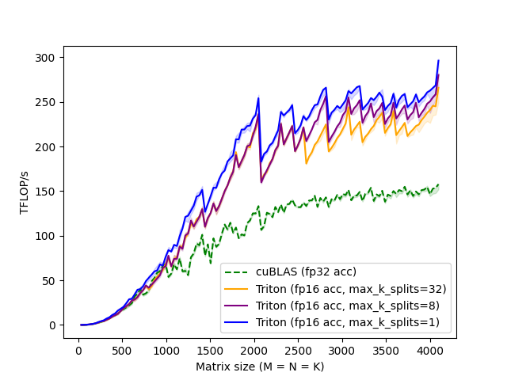
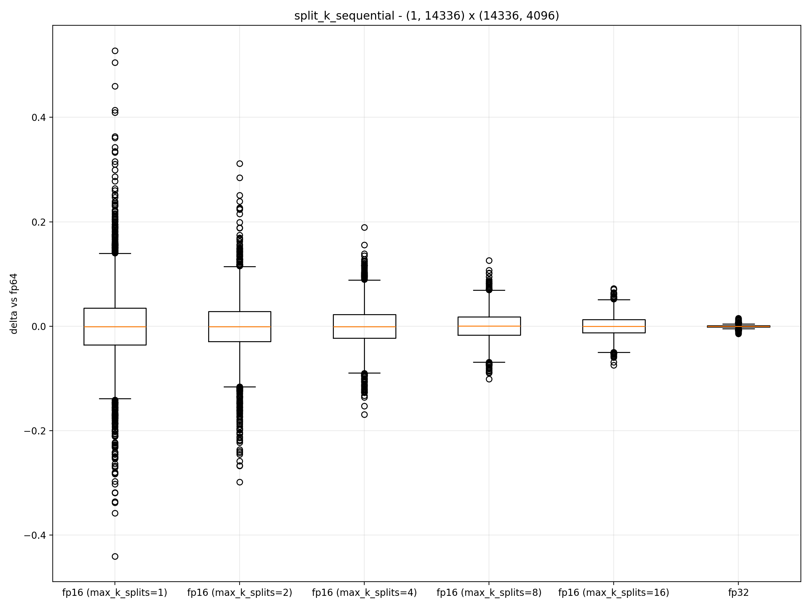

# gpu_poor

**This library has not been thoroughly tested yet, and is therefore likely to have bugs, performance issues, and otherwise sharp edges. Production use is not recommended.**

gpu_poor is an experimental library that aims to speed up training and inference on RTX GPUs by up to 2x by using the float16 accumulation mode on the tensor cores. _For enterprise cards like the RTX 6000 Ada or H100 this library will almost certainly not provide any speedups._

Switching to float16 accumulation is not a free lunch however, and the rounding errors it introduces can be unacceptably high even for many inference applications. To make matters worse, we cannot apply techniques such as [compensated summation](https://en.wikipedia.org/wiki/Kahan_summation_algorithm) because the added overhead is likely to be larger than any potential speedup.

We do however find that using split-k with many splits can mitigate a significant portion of the rounding errors at a small performance cost. Whether this is enough to make the rounding errors acceptable depends on the particular application, and we are currently investigating training and inference workloads to determine if this is a viable solution.

## Installation

```bash
pip install git+https://github.com/sekstini/gpupoor
```

## Usage

### Calling the kernel directly

```python
import torch
from gpu_poor.kernels import split_k_sequential

m, n, k = 1024, 1024, 4096

weight = torch.randn(n, k, dtype=torch.float16, device="cuda")
bias = torch.randn(1, n, dtype=torch.float32, device="cuda")
x = torch.randn(m, k, dtype=torch.float16, device="cuda")

y = split_k_sequential(x, weight.T) # x @ weight.T + bias
```

### Using the nn.Linear compatible module

```python
import torch
from gpu_poor.modules import LowPrecisionLinear

m, n, k = 1024, 1024, 4096

linear = LowPrecisionLinear(k, n).to("cuda", torch.float16)
x = torch.randn(m, k, dtype=torch.float16, device="cuda")

y = linear(x)
```

## Performance


RTX 4090 matmul performance on square matrices.

## Accuracy


The accuracy of `split_k_sequential` rises (up to a point) as we increase the number of splits.

## License

This project is licensed under the MIT License.
